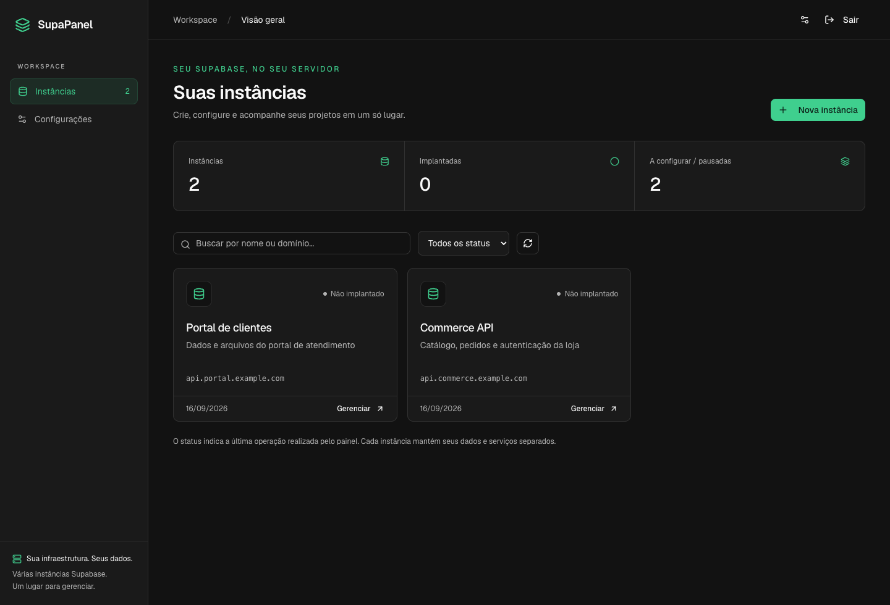
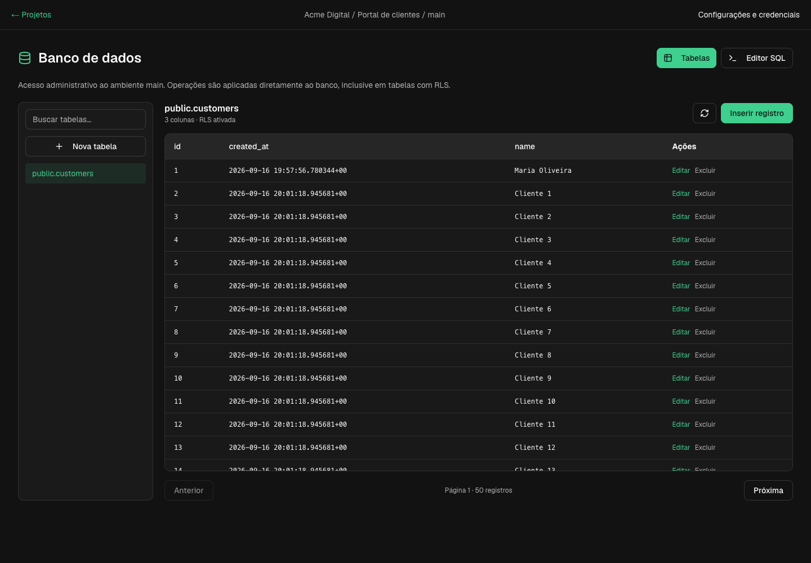
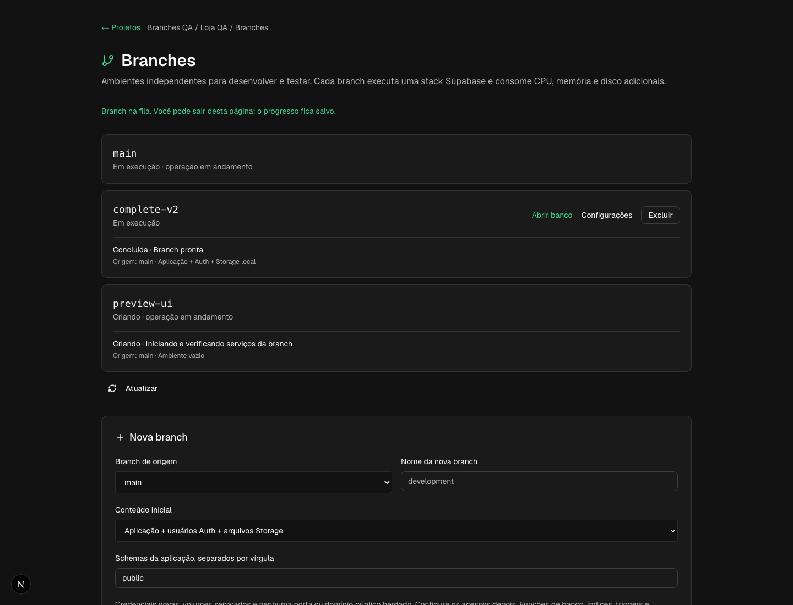
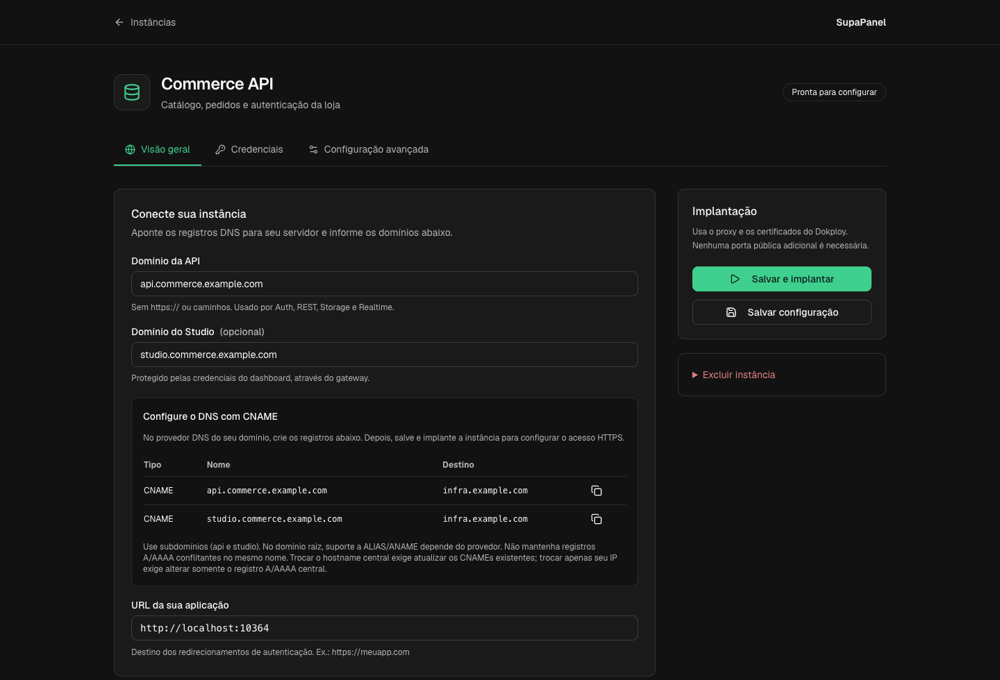
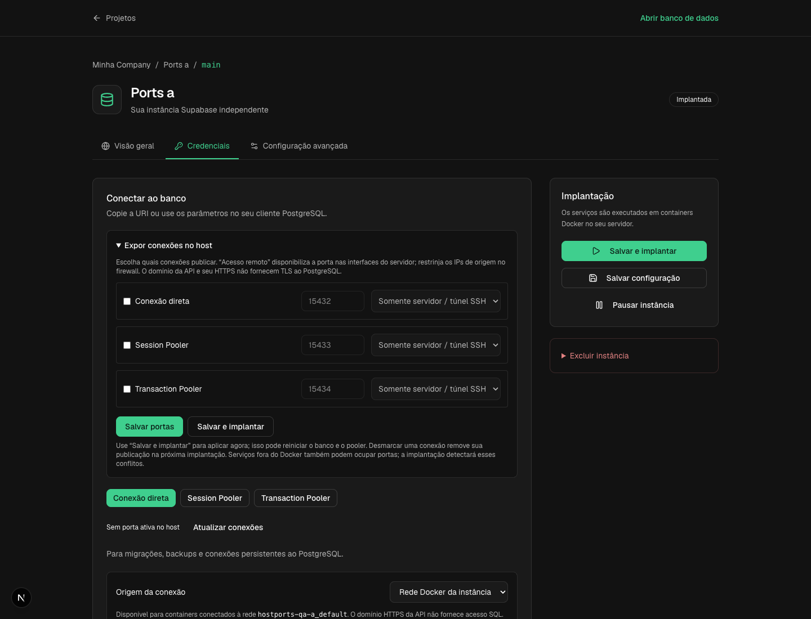

<div align="center">
  
  <h1>SupaPanel</h1>
  <p><strong>Várias instâncias Supabase self-hosted. Um único painel.</strong></p>

  [](LICENSE)
  [](docker-compose.yml)

  
</div>

## Banco de dados integrado

Abra um projeto para acessar suas tabelas e o editor SQL sem entrar no Studio separado.



- Liste e pesquise tabelas por schema/nome e navegue pelos registros em páginas de 50.
- Crie tabelas em `public`, com chave primária automática, `created_at` e RLS ativada.
- Insira, edite e exclua registros pelo formulário. Edição/exclusão exigem chave primária e recusam sobrescrever um registro alterado desde a leitura.
- Execute uma instrução SQL por vez; instruções não SELECT exigem confirmação. SELECT pode conter funções com efeitos no banco: o editor é uma ferramenta administrativa.
- O editor SQL exibe até 200 registros e configura timeout de 10 segundos; respostas acima de 2 MB são recusadas. Em erro de transporte, confira o estado antes de repetir uma alteração.

O acesso respeita a Company e usa o serviço `meta` da própria instância via Docker Compose, sem publicar pg-meta ou portas SQL. A instância precisa estar implantada, com `db` e `meta` disponíveis. As operações usam acesso administrativo ao banco, inclusive quando há RLS; viewers não têm acesso ao editor. Constraints, políticas e alterações avançadas de estrutura são feitas pelo SQL nesta versão. Controle manual de transações, COPY, DO e CALL exigem um cliente externo; cancelamento manual e histórico de consultas ainda não estão disponíveis.

## Branches adicionais e clonagem

Abra um projeto → **Gerenciar branches** para criar um ambiente vazio, copiar somente a estrutura, copiar estrutura + dados da aplicação ou incluir **Auth e Storage local**. A fila salva o progresso e cada branch recebe credenciais e volumes independentes. O seletor de branch está disponível no banco e nas configurações.

A clonagem completa pausa temporariamente os serviços da origem para copiar banco e arquivos; os usuários precisam fazer novo login na cópia. As novas branches começam sem portas públicas ou domínios. Falhas ficam visíveis e a cópia incompleta pode ser removida; `main` é protegida enquanto houver outras branches. Merge/promoção e GitHub ainda não estão incluídos.

Veja [modos, compatibilidade, recuperação e limites da clonagem](docs/BRANCHES.md).



## Companies e projetos — desenvolvimento do Studio unificado

O painel agora permite criar várias **Companies**, selecionar seus projetos e gerenciar membros por Company. Cada projeto novo começa com uma branch **main**, com a configuração e as credenciais de sua instância. O contexto Company / projeto / main aparece na configuração.

As instalações existentes são associadas automaticamente a uma Company inicial do proprietário no primeiro acesso. Essa associação altera somente metadados: IDs, nomes Docker, volumes, domínios e segredos existentes são preservados.

- **owner/admin:** gerenciam membros e operam projetos; somente owners gerenciam outros owners. A Company sempre mantém pelo menos um owner.
- **developer:** cria e opera projetos, incluindo acesso às credenciais.
- **viewer:** acompanha a visão geral, sem acesso aos dados, segredos ou operações da instância.
- O primeiro usuário da instalação administra as configurações globais e pode cadastrar novas contas pela tela de membros. Para contas novas, informe uma senha de pelo menos 12 caracteres; não há envio automático de convite por email. Outros gestores adicionam contas já cadastradas.

**Escopo atual:** Companies, projetos com múltiplas branches, clonagem com Auth/Storage local, editor de tabelas e SQL integrado. Promoção/merge e automação GitHub continuam futuros; veja a [arquitetura e o escopo](docs/UNIFIED-STUDIO.md).

Ao atualizar, faça backup do banco de metadados do painel e use a imagem construída deste código. O entrypoint aplica a expansão aditiva do schema com `prisma db push`; em desenvolvimento, execute `npm run db:push` e `npm run db:generate`. Não use uma imagem antiga contra o schema novo: versões antigas não aplicam as permissões por Company.


Crie e gerencie instâncias Supabase independentes no mesmo servidor, sem montar manualmente uma stack para cada projeto. Cada instância tem seu próprio PostgreSQL, Auth, Storage, Realtime, Edge Functions, Studio, credenciais, volumes e rede privada.

> Baseado em [sharonpraju/SupaConsole](https://github.com/sharonpraju/SupaConsole).

## Recursos

- Instalação via **Docker Compose no Dokploy**, aproveitando seu Traefik e HTTPS.
- Dashboard responsivo com busca, filtros e acesso direto ao gerenciamento.
- Criação com download automático do template e geração criptográfica de credenciais.
- Domínios separados para API e Studio, com instruções de **CNAME** prontas para copiar.
- **Conexão direta, Session Pooler e Transaction Pooler**: URI, host, porta, banco, usuário e senha, com botões de cópia.
- Conexões calculadas a partir do Compose salvo e verificadas no Docker: publicação de portas pela UI, com estado ativo ou aguardando implantação.
- Salvar e implantar, pausar preservando dados e excluir mediante confirmação pelo nome.
- Studio protegido pelo gateway e operações autorizadas pelos papéis da Company.

## Instalar no Dokploy

1. Crie um serviço **Docker Compose** apontando para este repositório, com Compose Path `./docker-compose.yml`.
2. Configure em **Environment**:

   ```dotenv
   POSTGRES_PASSWORD=senha_alfanumerica_aleatoria
   NEXTAUTH_SECRET=segredo_aleatorio_longo
   NEXTAUTH_URL=https://panel.seudominio.com
   DATA_PATH=/etc/supapanel
   PROXY_NETWORK=dokploy-network
   INSTANCE_DNS_TARGET=infra.seudominio.com
   ```

   Gere cada segredo separadamente com `openssl rand -hex 32`.
3. Em **Domains**, associe o domínio do painel ao serviço `panel`, porta `3000`, com HTTPS.
4. Implante e abra o painel para criar a conta de administrador. O cadastro público fecha após a primeira conta.
5. Crie uma instância, configure os domínios e clique em **Salvar e implantar**.

O Compose instala o painel e seu banco de metadados. As instâncias criadas são stacks independentes, gerenciadas pelo SupaPanel no mesmo Docker daemon. Não são criadas como aplicações separadas no Dokploy.

O painel precisa do socket Docker. `DATA_PATH` deve ser o mesmo caminho absoluto no host e no container, pois os serviços criados usam os arquivos desse diretório. O socket concede controle administrativo do Docker; restrinja o acesso ao painel.

Veja o [guia completo de instalação e persistência](docs/DOKPLOY.md).

### Domínios com CNAME

Configure um hostname central, por exemplo:

| Tipo | Nome | Destino |
|---|---|---|
| A | `infra.seudominio.com` | IP do servidor |
| CNAME | `api.cliente.com` | `infra.seudominio.com` |
| CNAME | `studio.cliente.com` | `infra.seudominio.com` |

Em **Configurações → Hostname para os domínios das instâncias**, salve `infra.seudominio.com`. Também é possível definir `INSTANCE_DNS_TARGET`; se não houver configuração, o painel utiliza o hostname de `NEXTAUTH_URL`, quando válido.

Use o hostname central em modo **DNS only**, apontando diretamente ao servidor, sem proxy/CDN. Isso evita depender do proxy do domínio do painel; consulte as [restrições de CNAME entre contas Cloudflare](https://developers.cloudflare.com/dns/cname-flattening/).

Na instância, informe `api.cliente.com` e `studio.cliente.com`. O painel mostra os registros DNS e permite copiar o destino. Crie esses registros no provedor DNS e clique em **Salvar e implantar**. O Traefik identifica o domínio solicitado e encaminha para a instância correta; o CNAME sozinho não configura o roteamento nem os certificados.

Se o IP do servidor mudar, atualize apenas o A/AAAA do hostname central. Se mudar o hostname central, os CNAMEs existentes precisam ser atualizados. Use subdomínios: ALIAS/ANAME no domínio raiz depende do provedor. Não crie CNAME apontando para si mesmo nem registros A/AAAA conflitantes no mesmo nome. O painel não altera automaticamente seu provedor DNS.



### Conectar ao PostgreSQL

Abra **Instância → Credenciais → Conectar ao banco**:

| Método | Uso | Usuário | Porta interna |
|---|---|---|---|
| Conexão direta | Migrações, backups e conexões persistentes | `postgres` | `5432` |
| Session Pooler | Sessões persistentes, compatível com prepared statements | `postgres.<POOLER_TENANT_ID>` | `5432` |
| Transaction Pooler | Conexões curtas; desative prepared statements no cliente | `postgres.<POOLER_TENANT_ID>` | `6543` |

A interface mostra a URI e cada parâmetro separadamente, com senha oculta e botões para copiar. Caracteres especiais da senha são codificados na URI. As informações refletem a configuração salva; mudanças precisam ser implantadas.

No Dokploy, SQL começa disponível apenas na rede privada da instância. Para conectar um cliente externo, abra **Credenciais → Expor conexões no host**:

1. Ative Conexão direta, Session Pooler e/ou Transaction Pooler e escolha uma porta diferente para cada conexão e instância.
2. Selecione **Somente servidor / túnel SSH** (`127.0.0.1`) ou **Acesso remoto** (`0.0.0.0`). Para acesso remoto, restrinja os IPs de origem no firewall do servidor/provedor.
3. Use **Salvar e implantar** para aplicar agora, ou **Salvar portas** para preparar uma implantação posterior. A aplicação pode reiniciar o banco e o pooler.
4. Escolha **Porta publicada no servidor** na origem da conexão e copie a URI. No acesso remoto, informe o IP ou hostname DNS do servidor, sem `https://`.

O painel verifica conflitos com portas reservadas por outras instâncias, mesmo paradas, e containers em execução. Processos fora do Docker podem causar conflitos detectados na implantação. O indicador confirma o mapeamento ativo no Docker; não testa firewall, conectividade externa ou autenticação SQL. Desmarcar uma conexão remove sua publicação após implantar novamente.

O domínio HTTPS da API/Studio **não publica PostgreSQL** nem habilita TLS no banco. Um hostname DNS pode substituir o IP na conexão TCP, mas a porta continua necessária. A publicação não configura o firewall automaticamente. Instâncias com arquivos Compose override precisam consolidar seus mapeamentos no arquivo principal antes de gerenciar portas pela UI.



## Versão do Supabase

Novas instâncias usam o commit oficial [`9e225a2`](https://github.com/supabase/supabase/tree/9e225a279b33e4e6e1452e573a40a6a25aa2cb2f/docker), de 03/08/2026, incluindo:

| Serviço | Imagem |
|---|---|
| Studio | `supabase/studio:2026.08.03-sha-022b374` |
| Kong | `kong/kong:3.9.3` |
| Auth | `supabase/gotrue:v2.189.0` |
| REST | `postgrest/postgrest:v14.12` |
| Realtime | `supabase/realtime:v2.102.3` |
| Storage | `supabase/storage-api:v1.60.4` |
| imgproxy | `darthsim/imgproxy:v3.30.1` |
| Meta | `supabase/postgres-meta:v0.96.6` |
| Edge Functions | `supabase/edge-runtime:v1.74.0` |
| PostgreSQL | `supabase/postgres:17.6.1.136` |
| Supavisor | `supabase/supavisor:2.9.5` |

`SUPABASE_CORE_REF` permite selecionar outro commit/tag compatível. Instâncias existentes mantêm seu template: migrar PostgreSQL 15 para 17 exige backup e migração específica, não somente trocar a imagem sobre o mesmo volume.

## Operação e backups

- **Pausar:** interrompe os serviços e preserva dados.
- **Salvar e implantar:** aplica a configuração e aguarda a inicialização dos serviços.
- **Excluir:** remove containers, volumes e arquivos permanentemente. Requer digitar o nome da instância.
- O status do dashboard indica a última operação realizada pelo painel.
- Faça backup do banco de metadados, de `${DATA_PATH}/projects` e dos volumes Docker de cada instância, incluindo `<slug>_postgres-data` e `<slug>_storage-data` nas novas stacks.
- Cada instância executa uma stack completa; dimensione memória, CPU e disco para a quantidade de projetos.

## VPS sem Dokploy

O instalador legado configura Docker e seu próprio Traefik. Use somente em servidor sem outro proxy ocupando as mesmas portas:

```sh
curl -sSL https://raw.githubusercontent.com/alanfrigo/SupaPanel/main/install.sh | sh
```

Para usar estas alterações antes de uma release da imagem publicada, prefira construir a imagem deste checkout pelo Compose do repositório. Não execute o instalador legado sobre uma instalação Dokploy.

## Desenvolvimento

```sh
npm ci
cp .env.example .env
docker compose -f docker-compose.dev.yml up -d
npm run db:generate
npm run db:push
npm run dev
```

Ajuste `DATABASE_URL` para seu banco local. Verificações:

```sh
npm test
npm run lint
npm run type-check
npm run build
```

Stack: Next.js, React, TypeScript, Tailwind, Prisma, PostgreSQL e Docker Compose.

Consulte [TESTING.md](docs/TESTING.md), o [guia Dokploy](docs/DOKPLOY.md) e o [registro de validação](docs/VALIDATION.md). Os prints mostram instâncias de demonstração locais. DNS e emissão de certificados reais precisam ser verificados no servidor de destino.

## Licença

[MIT](LICENSE). Agradecimentos ao SupaConsole, Supabase e Traefik.
